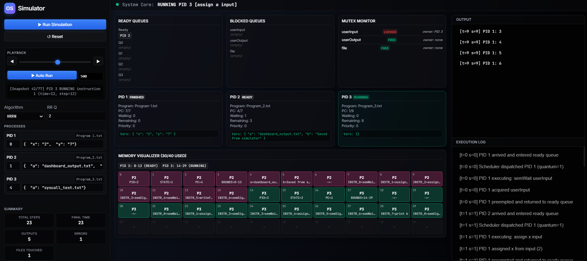

<div align="center">

# 🖥️ Operating System Simulator

**A fully functional OS kernel simulator built from scratch in C, with a web dashboard for visualization.**

[](src/)
[](server.js)

</div>

---

## 📖 Overview

This project simulates a real operating system kernel — handling process creation, CPU scheduling, memory allocation, and resource synchronization. Programs are loaded from text files and executed instruction-by-instruction through an interpreter, while three scheduling algorithms compete for CPU time. A Node.js-powered web dashboard provides real-time visualization of the entire simulation.

---

## ✨ Features

- **Process Management** — Full PCB lifecycle: NEW → READY → RUNNING → BLOCKED → FINISHED
- **3 Scheduling Algorithms**
  - **HRRN** — Highest Response Ratio Next (non-preemptive)
  - **Round Robin** — Preemptive with configurable time quantum
  - **MLFQ** — 4 priority levels with exponential quantum (2^i)
- **Memory Management** — 40-word simulated RAM with first-fit contiguous allocation
- **Swap Space** — Automatic swap-out/swap-in when memory is full
- **Mutex Synchronization** — `semWait` / `semSignal` on 3 shared resources (userInput, userOutput, file)
- **System Calls** — `print`, `assign`, `readFile`, `writeFile`, `printFromTo`
- **Instruction Interpreter** — Reads and executes programs from `.txt` files line by line
- **Web Dashboard** — Real-time visualization of memory, queues, mutexes, and process states

---

## 📸 Dashboard Preview



---

## 🏗️ Project Structure

```
OperatingSystem/
├── src/                    # C kernel source code
│   ├── main.c              # Entry point & simulation loop
│   ├── scheduler.c         # HRRN, RR, MLFQ scheduling
│   ├── os_memory.c         # Memory allocation & swap
│   ├── interpreter.c       # Instruction parser & executor
│   ├── process.c           # Process creation
│   ├── syscalls.c          # System call implementations
│   └── queue.c             # Queue data structures
├── include/
│   ├── os_shared.h         # Shared types & API declarations
│   └── queue.h             # Queue interface
├── programs/               # Sample programs (instruction files)
├── frontend/               # Web dashboard (HTML/CSS/JS)
├── server.js               # Express API & simulation engine
└── package.json
```

---

## 🚀 How to Run

### Web Dashboard

```bash
git clone https://github.com/badrmohamed23/OperatingSystem.git
cd OperatingSystem
npm install
node server.js
```

Open **http://localhost:3000** → Click **▶ Run Simulation**

### C Kernel (Console)

```bash
gcc -Iinclude src/*.c -o os_sim.exe
./os_sim.exe
```

---

## 🛠️ Tech Stack

| Layer | Technology |
|-------|------------|
| OS Kernel | C (gcc / MinGW) |
| Backend API | Node.js, Express |
| Frontend | HTML, CSS, Vanilla JavaScript |

---

## 👥 Collaborators

| Name | GitHub |
|---|---|
| Mohamed Enan | [@Mo7amed3nan](https://github.com/Mo7amed3nan) |
| Badr Maghraby | [@badrmohamed23](https://github.com/badrmohamed23) |
| Omar Abdelwahab | [@Omarr-Abdelwahab](https://github.com/Omarr-Abdelwahab) |


---

<div align="center">

**Built with ❤️ as a university Operating Systems course project.**

</div>
